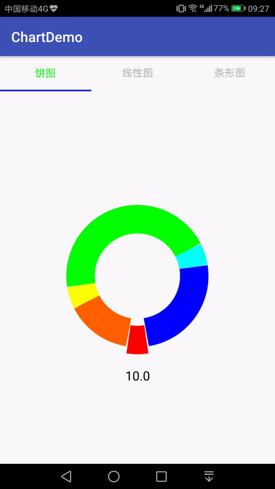
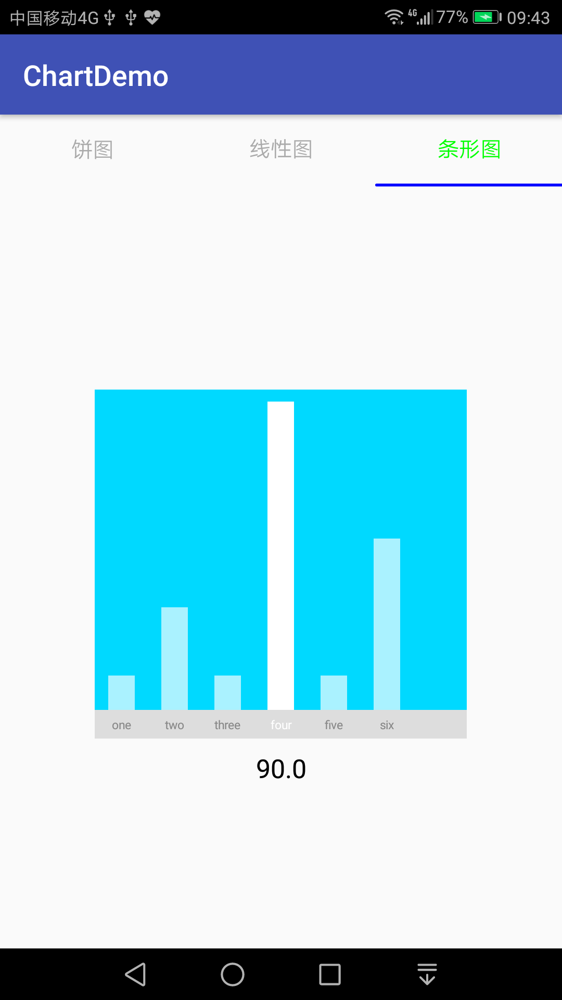
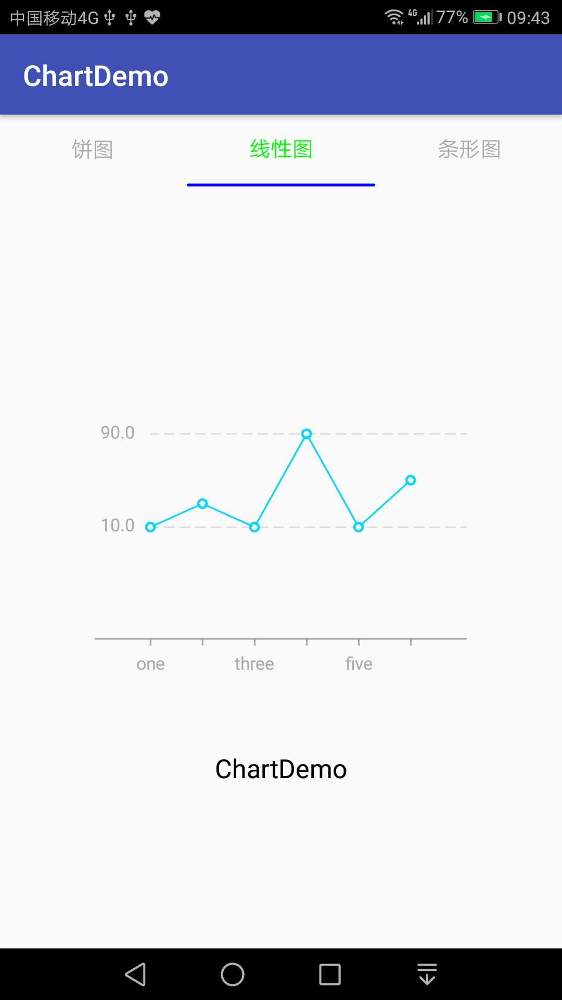

## Chart 图表类控件库
当前图表控件只提供三类:饼图、条形图和线性图,使用kotlin为实现语言.详细介绍如下。





#### 如何引用
在build.gradle中添加如下代码:

```
	allprojects {
		repositories {
			...
			maven { url 'https://jitpack.io' }
		}
	}

	
	dependencies {
    	        compile 'com.github.fishly:ChartLibs:1.1'
    }

```


布局如下:

```
<LinearLayout xmlns:android="http://schemas.android.com/apk/res/android"
    android:orientation="vertical"
    android:gravity="center"
    android:layout_width="260dp"
    android:layout_height="match_parent">


    <cn.enjoytoday.chart.widget.PieChart
        android:id="@+id/pieChart"
        android:visibility="gone"
        android:layout_width="260dp"
        android:layout_height="260dp" />

    <cn.enjoytoday.chart.widget.LineChart
        android:visibility="gone"
        android:id="@+id/lineChart"
        android:layout_width="260dp"
        android:layout_height="260dp" />


    <cn.enjoytoday.chart.widget.BarChart

        android:id="@+id/barChart"
        android:layout_width="260dp"
        android:layout_height="260dp" />


    <TextView
        android:id="@+id/text_view"
        android:textSize="18sp"
        android:gravity="center"
        android:text="@string/app_name"
        android:textColor="@android:color/black"
        android:layout_width="match_parent"
        android:layout_height="wrap_content" />

</LinearLayout>

````


### 饼图
PieChart


使用方法:
```

val list:MutableList<PartModel> = mutableListOf()
list.add(PartModel(10f,"one","0"))
list.add(PartModel(30f,"two","1"))
list.add(PartModel(10f,"three","2"))
list.add(PartModel(90f,"four","3"))
list.add(PartModel(10f,"five","4"))
list.add(PartModel(50f,"six","5"))
                
pieChart.setList(list)  //设置数据源
pieChart.onSelectedListener=object : OnSelectedListener{ //选择回调
          override fun onSelectedListener(index: Int, partModel: PartModel) {
                   view.text_view.text="${partModel.value}"
          }
                
}
```


### 条形图
BarChart


使用方法

```

val list:MutableList<PartModel> = mutableListOf()
list.add(PartModel(10f,"one","0"))
list.add(PartModel(30f,"two","1"))
list.add(PartModel(10f,"three","2"))
list.add(PartModel(90f,"four","3"))
list.add(PartModel(10f,"five","4"))
list.add(PartModel(50f,"six","5"))
barChart.setList(list)  //设置数据源
barChart.onSelectedListener=object : OnSelectedListener{ //选择回调
        override fun onSelectedListener(index: Int, partModel: PartModel) {
                     view.text_view.text="${partModel.value}"
        }
}
```


### 线性图
LineChart



使用方法

```
val sums= mutableListOf<Float>(10f,30f,10f,90f,10f,50f)
val lables= mutableListOf<String>()

lineChart.maxScore= sums.max()
lineChart.minScore=sums.min()
lineChart.monthCount=sums.size
lineChart.monthText=lables
lineChart.score=sums

lineChart.onSelectedListener=object :OnSelectedListener{
       override fun onSelectedListener(index: Int, partModel: PartModel) {
                view.text_view.text="${partModel.value}"
       }
}

```


